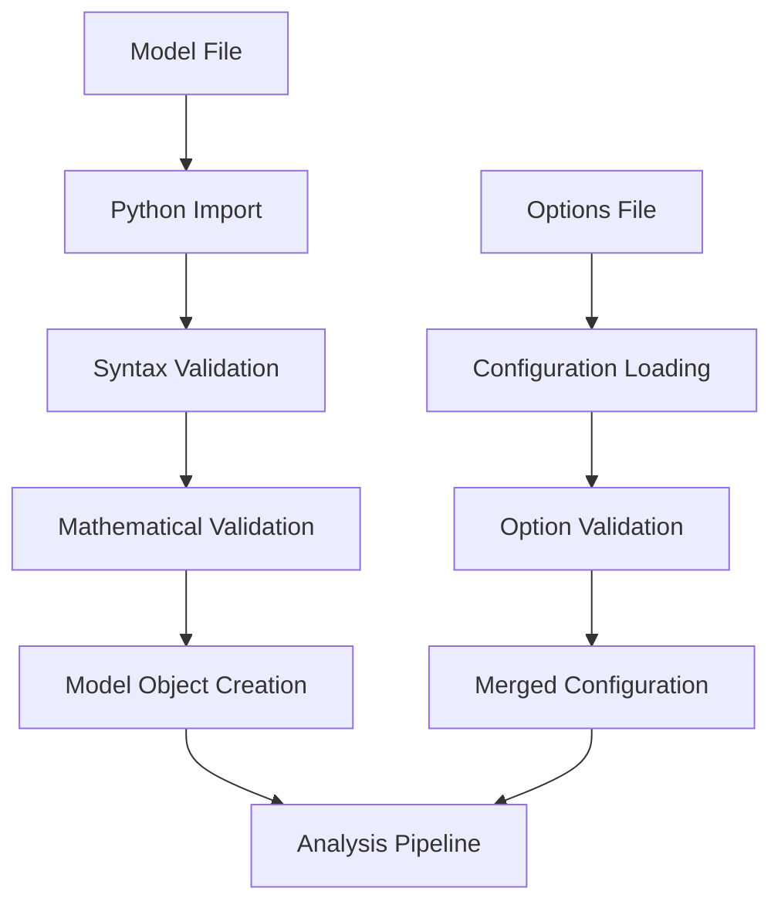
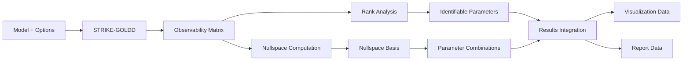

# Code Architecture

This document provides a comprehensive overview of NullStrike's architecture, design patterns, and internal workings. Understanding this architecture is essential for developers who want to contribute to or extend NullStrike.

## High-Level Overview

NullStrike is built as a modular system that extends the STRIKE-GOLDD algorithm with enhanced nullspace analysis. The architecture follows a layered design:

```
┌─────────────────────────────────────────────────────────┐
│                   User Interface Layer                 │
│  ┌─────────────────┐      ┌─────────────────────────┐  │
│  │   CLI Interface │      │    Python API           │  │
│  │  (complete_     │      │  (direct function       │  │
│  │   analysis.py)  │      │   calls)                │  │
│  └─────────────────┘      └─────────────────────────┘  │
└─────────────────────────────────────────────────────────┘
                              │
┌─────────────────────────────────────────────────────────┐
│                 Analysis Orchestration                 │
│  ┌─────────────────────────────────────────────────────┐ │
│  │         integrated_analysis.py                     │ │
│  │  • Workflow coordination                           │ │
│  │  • State management                                │ │
│  │  • Progress tracking                               │ │
│  └─────────────────────────────────────────────────────┘ │
└─────────────────────────────────────────────────────────┘
                              │
┌─────────────────────────────────────────────────────────┐
│                   Core Analysis Layer                  │
│  ┌─────────────────┐  ┌──────────────────────────────┐  │
│  │ STRIKE-GOLDD    │  │  Enhanced Nullspace Analysis │  │
│  │ (strike_goldd.py│  │  (enhanced_subspace.py)      │  │
│  │ • Lie derivatives│  │  • Nullspace computation     │  │
│  │ • Observability │  │  • Parameter combinations     │  │
│  │ • Identifiability│  │  • Constraint analysis       │  │
│  └─────────────────┘  └──────────────────────────────┘  │
└─────────────────────────────────────────────────────────┘
                              │
┌─────────────────────────────────────────────────────────┐
│                Supporting Services Layer               │
│  ┌─────────────────┐  ┌────────────────┐ ┌────────────┐ │
│  │ Visualization   │  │ Checkpointing  │ │ Model      │ │
│  │ (manifolds.py,  │  │ (checkpointing │ │ Management │ │
│  │  graphs.py)     │  │  .py)          │ │ (models/)  │ │
│  └─────────────────┘  └────────────────┘ └────────────┘ │
└─────────────────────────────────────────────────────────┘
                              │
┌─────────────────────────────────────────────────────────┐
│                    Foundation Layer                    │
│  ┌─────────────────┐  ┌────────────────┐ ┌────────────┐ │
│  │ SymPy Engine    │  │ NumPy/SciPy    │ │ Config     │ │
│  │ • Symbolic math │  │ • Numerical    │ │ Management │ │
│  │ • Derivatives   │  │   computation  │ │ (configs/) │ │
│  │ • Matrix ops    │  │ • Linear algebra│ │            │ │
│  └─────────────────┘  └────────────────┘ └────────────┘ │
└─────────────────────────────────────────────────────────┘
```

## Module Structure

### Core Modules

#### `nullstrike.cli` - Command Line Interface

**Primary File**: `complete_analysis.py`

```python
# Entry point structure
def cli_main():
    """Main CLI entry point."""
    args = parse_arguments()
    return main(args.model_name, args.options_file, args.parameters_only)

def main(model_name, options_file=None, parameters_only=False):
    """Core analysis orchestration."""
    # 1. Load model and options
    # 2. Initialize analysis components
    # 3. Run analysis pipeline
    # 4. Generate outputs
    # 5. Return results
```

**Key Responsibilities**:
- Argument parsing and validation
- Model/options file loading
- Analysis workflow orchestration
- Progress reporting and error handling
- Results packaging and output

**Design Patterns**:
- **Command Pattern**: CLI commands map to analysis functions
- **Facade Pattern**: Simplifies complex analysis pipeline
- **Template Method**: Consistent workflow structure

#### `nullstrike.core` - STRIKE-GOLDD Implementation

**Primary File**: `strike_goldd.py`

```python
class STRIKEGOLDDAnalyzer:
    """Core STRIKE-GOLDD implementation."""
    
    def __init__(self, model, options):
        self.model = model
        self.options = options
        self.observability_matrix = None
        self.identifiable_parameters = []
    
    def compute_observability_matrix(self):
        """Compute the observability-identifiability matrix."""
        # Lie derivative computation
        # Matrix construction
        # Symbolic simplification
    
    def analyze_identifiability(self):
        """Determine parameter identifiability."""
        # Rank analysis
        # Parameter classification
        # Results compilation
```

**Mathematical Foundation**:

The core algorithm computes:

$$\mathcal{O} = \begin{bmatrix}
\frac{\partial h}{\partial p} \\
\frac{\partial \mathcal{L}_f h}{\partial p} \\
\frac{\partial \mathcal{L}_f^2 h}{\partial p} \\
\vdots \\
\frac{\partial \mathcal{L}_f^n h}{\partial p}
\end{bmatrix}$$

Where:
- $h$ are output functions
- $\mathcal{L}_f^k h$ is the k-th Lie derivative
- $p$ are parameters
- $\mathcal{O}$ is the observability-identifiability matrix

**Key Algorithms**:
1. **Lie Derivative Computation**: Recursive symbolic differentiation
2. **Matrix Construction**: Row-wise assembly of derivatives
3. **Rank Analysis**: Symbolic rank determination
4. **Parameter Classification**: Identifiable vs. unidentifiable

#### `nullstrike.analysis` - Enhanced Analysis

**Primary File**: `enhanced_subspace.py`

```python
class NullspaceAnalyzer:
    """Enhanced nullspace analysis for parameter combinations."""
    
    def __init__(self, observability_matrix, parameters):
        self.obs_matrix = observability_matrix
        self.parameters = parameters
        self.nullspace_basis = None
        self.identifiable_combinations = []
    
    def compute_nullspace(self):
        """Compute nullspace of observability matrix."""
        # Symbolic nullspace computation
        # Basis vector extraction
        # Numerical verification
    
    def find_identifiable_combinations(self):
        """Find identifiable parameter combinations."""
        # Row space analysis
        # Combination extraction
        # Mathematical interpretation
```

**Mathematical Framework**:

The nullspace analysis computes:

$$\begin{align}
\mathcal{N} &= \text{nullspace}(\mathcal{O}) \\
\mathcal{I} &= \text{nullspace}(\mathcal{N}) \\
\text{combinations} &= \mathcal{I} \cdot p
\end{align}$$

Where:
- $\mathcal{N}$ contains unidentifiable directions
- $\mathcal{I}$ contains identifiable combination vectors
- The combinations are linear forms in parameters

**Key Features**:
1. **Symbolic Nullspace**: Using SymPy for exact computation
2. **Numerical Verification**: Cross-check with numerical methods
3. **Combination Extraction**: Meaningful parameter relationships
4. **Constraint Analysis**: Geometric interpretation

#### `nullstrike.analysis.integrated_analysis` - Workflow Orchestration

```python
class AnalysisWorkflow:
    """Complete analysis workflow manager."""
    
    def __init__(self, model, options):
        self.model = model
        self.options = options
        self.checkpointer = CheckpointManager()
        self.visualizer = VisualizationManager()
    
    def run_complete_analysis(self):
        """Execute full analysis pipeline."""
        try:
            # Phase 1: STRIKE-GOLDD analysis
            self._run_strike_goldd()
            
            # Phase 2: Nullspace analysis  
            self._run_nullspace_analysis()
            
            # Phase 3: Visualization generation
            self._generate_visualizations()
            
            # Phase 4: Report generation
            self._generate_reports()
            
        except Exception as e:
            self._handle_analysis_error(e)
```

**Design Patterns**:
- **Template Method**: Consistent analysis pipeline
- **State Management**: Checkpointing for recovery
- **Observer Pattern**: Progress notifications
- **Strategy Pattern**: Configurable analysis options

### Supporting Modules

#### `nullstrike.visualization` - Visualization System

**Architecture**:
```python
# Base visualization framework
class VisualizationBase:
    """Base class for all visualizations."""
    
    def __init__(self, results, options):
        self.results = results
        self.options = options
    
    def generate(self):
        """Template method for visualization generation."""
        self.prepare_data()
        self.create_plot()
        self.save_output()

# Specialized visualizations
class ManifoldVisualizer(VisualizationBase):
    """3D parameter manifold visualization."""
    
class GraphVisualizer(VisualizationBase):
    """Parameter dependency graph visualization."""
    
class ProjectionVisualizer(VisualizationBase):
    """2D parameter space projections."""
```

**Visualization Pipeline**:
1. **Data Preparation**: Extract relevant analysis results
2. **Plot Generation**: Create matplotlib/plotly visualizations
3. **Styling**: Apply consistent themes and formatting
4. **Export**: Save in multiple formats (PNG, PDF, HTML)

#### `nullstrike.analysis.checkpointing` - State Management

```python
class CheckpointManager:
    """Manage analysis state and enable resumption."""
    
    def __init__(self, checkpoint_dir):
        self.checkpoint_dir = checkpoint_dir
        self.state_history = []
    
    def save_checkpoint(self, stage, data):
        """Save analysis state at checkpoint."""
        checkpoint = {
            'timestamp': time.time(),
            'stage': stage,
            'data': data,
            'hash': self._compute_hash(data)
        }
        self._write_checkpoint(checkpoint)
    
    def can_resume_from(self, stage):
        """Check if analysis can resume from stage."""
        return self._find_valid_checkpoint(stage) is not None
```

**Checkpointing Strategy**:
- **Stage-based**: Checkpoints at major analysis phases
- **Incremental**: Save only changed data
- **Verification**: Hash-based integrity checking
- **Recovery**: Automatic resumption on failure

## Data Flow Architecture

### Model Loading and Validation



**Validation Pipeline**:
1. **Syntax Check**: Valid Python syntax
2. **Required Variables**: States, parameters, dynamics, outputs
3. **Mathematical Consistency**: Dimension matching
4. **Symbolic Compatibility**: SymPy expression format

### Analysis Data Flow



### Memory Management

**Large Model Handling**:
```python
class MemoryEfficientAnalysis:
    """Memory-optimized analysis for large models."""
    
    def __init__(self, model, options):
        self.model = model
        self.options = options
        self.memory_limit = options.get('memory_limit', '4GB')
    
    def compute_observability_chunks(self):
        """Compute observability matrix in chunks."""
        chunk_size = self._calculate_chunk_size()
        
        for i in range(0, self.n_lie_derivatives, chunk_size):
            chunk = self._compute_lie_chunk(i, i + chunk_size)
            yield chunk
    
    def _calculate_chunk_size(self):
        """Determine optimal chunk size based on memory."""
        available_memory = self._get_available_memory()
        expression_size = self._estimate_expression_size()
        return available_memory // expression_size
```

## Extension Points

### Adding New Analysis Methods

**Plugin Architecture**:
```python
class AnalysisPlugin:
    """Base class for analysis plugins."""
    
    @abstractmethod
    def name(self) -> str:
        """Return plugin name."""
        pass
    
    @abstractmethod
    def analyze(self, model, options) -> AnalysisResults:
        """Perform analysis."""
        pass
    
    @abstractmethod
    def supports_model(self, model) -> bool:
        """Check if plugin supports model type."""
        pass

# Plugin registration
class PluginManager:
    def __init__(self):
        self.plugins = {}
    
    def register_plugin(self, plugin: AnalysisPlugin):
        self.plugins[plugin.name()] = plugin
    
    def run_analysis(self, method_name, model, options):
        plugin = self.plugins[method_name]
        return plugin.analyze(model, options)
```

**Example Plugin**:
```python
class FisherInformationPlugin(AnalysisPlugin):
    """Fisher Information Matrix analysis plugin."""
    
    def name(self) -> str:
        return "fisher_information"
    
    def analyze(self, model, options) -> AnalysisResults:
        # Compute Fisher Information Matrix
        fim = self._compute_fisher_matrix(model)
        
        # Analyze eigenvalues for identifiability
        eigenvals = self._compute_eigenvalues(fim)
        
        # Extract results
        return FisherResults(fim, eigenvals)
```

### Custom Visualization Types

**Visualization Plugin System**:
```python
class VisualizationPlugin:
    """Base class for visualization plugins."""
    
    @abstractmethod
    def create_visualization(self, results, options):
        """Create visualization from analysis results."""
        pass
    
    @abstractmethod
    def supported_formats(self) -> List[str]:
        """Return supported output formats."""
        pass

class HeatmapVisualization(VisualizationPlugin):
    """Parameter correlation heatmap visualization."""
    
    def create_visualization(self, results, options):
        correlation_matrix = self._compute_correlations(results)
        
        fig, ax = plt.subplots(figsize=(10, 8))
        sns.heatmap(correlation_matrix, ax=ax, 
                   cmap='RdBu_r', center=0, 
                   annot=True, fmt='.2f')
        
        return fig
```

### Model Format Extensions

**Model Loader System**:
```python
class ModelLoader:
    """Base class for model loaders."""
    
    @abstractmethod
    def can_load(self, file_path: str) -> bool:
        """Check if loader can handle file."""
        pass
    
    @abstractmethod
    def load_model(self, file_path: str) -> ModelDefinition:
        """Load model from file."""
        pass

class SBMLModelLoader(ModelLoader):
    """Load SBML models."""
    
    def can_load(self, file_path: str) -> bool:
        return file_path.endswith('.sbml') or file_path.endswith('.xml')
    
    def load_model(self, file_path: str) -> ModelDefinition:
        # Parse SBML file
        # Convert to NullStrike format
        # Return ModelDefinition
        pass
```

## Performance Optimization

### Symbolic Computation Optimization

**Expression Simplification**:
```python
class ExpressionOptimizer:
    """Optimize symbolic expressions for performance."""
    
    def __init__(self, options):
        self.simplify_level = options.get('simplify_level', 'basic')
        self.use_cse = options.get('common_subexpression', True)
    
    def optimize_expression(self, expr):
        """Apply optimization techniques to expression."""
        if self.use_cse:
            expr = self._apply_common_subexpression_elimination(expr)
        
        if self.simplify_level == 'aggressive':
            expr = sym.simplify(expr)
        elif self.simplify_level == 'basic':
            expr = sym.expand(expr)
        
        return expr
    
    def _apply_common_subexpression_elimination(self, expr):
        """Apply CSE to reduce computation."""
        replacements, reduced = sym.cse(expr)
        return reduced[0] if reduced else expr
```

**Parallel Computation**:
```python
class ParallelAnalyzer:
    """Parallel computation for large models."""
    
    def __init__(self, n_workers=None):
        self.n_workers = n_workers or cpu_count()
        self.executor = ProcessPoolExecutor(max_workers=self.n_workers)
    
    def compute_lie_derivatives_parallel(self, h, f, x, max_order):
        """Compute Lie derivatives in parallel."""
        futures = []
        
        for order in range(max_order + 1):
            future = self.executor.submit(
                self._compute_single_lie_derivative, 
                h, f, x, order
            )
            futures.append(future)
        
        results = [future.result() for future in futures]
        return results
```

### Memory Optimization

**Lazy Evaluation**:
```python
class LazyEvaluationManager:
    """Manage lazy evaluation of symbolic expressions."""
    
    def __init__(self):
        self._expression_cache = {}
        self._evaluation_graph = {}
    
    def add_expression(self, name, expr, dependencies=None):
        """Add expression to lazy evaluation graph."""
        self._evaluation_graph[name] = {
            'expression': expr,
            'dependencies': dependencies or [],
            'evaluated': False,
            'result': None
        }
    
    def evaluate(self, name):
        """Evaluate expression and its dependencies."""
        if self._evaluation_graph[name]['evaluated']:
            return self._evaluation_graph[name]['result']
        
        # Evaluate dependencies first
        for dep in self._evaluation_graph[name]['dependencies']:
            self.evaluate(dep)
        
        # Evaluate this expression
        expr = self._evaluation_graph[name]['expression']
        result = self._safe_evaluate(expr)
        
        self._evaluation_graph[name]['result'] = result
        self._evaluation_graph[name]['evaluated'] = True
        
        return result
```

## Testing Architecture

### Test Organization

```python
# Test structure
tests/
├── unit/                    # Unit tests for individual modules
│   ├── test_core.py            # STRIKE-GOLDD core tests
│   ├── test_analysis.py        # Nullspace analysis tests
│   ├── test_visualization.py   # Visualization tests
│   └── test_utils.py           # Utility function tests
├── integration/             # Integration tests
│   ├── test_workflows.py       # End-to-end workflow tests
│   ├── test_cli.py            # CLI interface tests
│   └── test_examples.py        # Built-in example tests
├── performance/             # Performance and benchmark tests
│   ├── test_large_models.py    # Large model performance
│   └── benchmark_suite.py      # Benchmark comparisons
└── fixtures/                # Test data and fixtures
    ├── test_models/            # Small test models
    └── expected_results/       # Expected analysis results
```

### Test Fixtures and Utilities

**Model Test Fixtures**:
```python
@pytest.fixture
def simple_linear_model():
    """Simple 2-state linear model for testing."""
    import sympy as sym
    
    # States
    x1, x2 = sym.symbols('x1 x2')
    x = [[x1], [x2]]
    
    # Parameters
    p1, p2 = sym.symbols('p1 p2')
    p = [[p1], [p2]]
    
    # Dynamics
    f = [[p1*x1], [p2*x2]]
    
    # Outputs
    h = [x1 + x2]
    
    return ModelDefinition(x, p, f, h)

@pytest.fixture
def unidentifiable_model():
    """Model with known unidentifiable parameters."""
    # Implementation that creates a model where
    # individual parameters are unidentifiable but
    # specific combinations are identifiable
    pass
```

**Analysis Verification**:
```python
class AnalysisVerifier:
    """Verify analysis results against known solutions."""
    
    def __init__(self, tolerance=1e-10):
        self.tolerance = tolerance
    
    def verify_nullspace_dimension(self, result, expected_dim):
        """Verify nullspace has expected dimension."""
        actual_dim = result.nullspace_basis.shape[1]
        assert actual_dim == expected_dim, \
            f"Expected nullspace dimension {expected_dim}, got {actual_dim}"
    
    def verify_identifiable_combinations(self, result, expected_combinations):
        """Verify identifiable combinations match expected."""
        actual = set(str(combo) for combo in result.identifiable_combinations)
        expected = set(str(combo) for combo in expected_combinations)
        
        assert actual == expected, \
            f"Combinations don't match.\nExpected: {expected}\nActual: {actual}"
```

## Error Handling and Debugging

### Exception Hierarchy

```python
class NullStrikeError(Exception):
    """Base exception for NullStrike errors."""
    pass

class ModelDefinitionError(NullStrikeError):
    """Errors in model definition."""
    pass

class ComputationError(NullStrikeError):
    """Errors during symbolic computation."""
    
    def __init__(self, message, stage=None, elapsed_time=None):
        super().__init__(message)
        self.stage = stage
        self.elapsed_time = elapsed_time

class VisualizationError(NullStrikeError):
    """Errors during visualization generation."""
    pass

class CheckpointError(NullStrikeError):
    """Errors in checkpointing system."""
    pass
```

### Debugging Support

**Debug Mode**:
```python
class DebugManager:
    """Manage debugging information and output."""
    
    def __init__(self, debug_level='INFO'):
        self.debug_level = debug_level
        self.logger = self._setup_logger()
    
    def log_computation_step(self, step_name, expression, timing=None):
        """Log computation step for debugging."""
        if self.debug_level == 'DEBUG':
            self.logger.debug(f"Step: {step_name}")
            self.logger.debug(f"Expression: {expression}")
            if timing:
                self.logger.debug(f"Time: {timing:.3f}s")
    
    def save_intermediate_results(self, stage, results):
        """Save intermediate results for inspection."""
        debug_dir = Path("debug_output")
        debug_dir.mkdir(exist_ok=True)
        
        with open(debug_dir / f"{stage}_results.pkl", 'wb') as f:
            pickle.dump(results, f)
```

**Profiling Integration**:
```python
class PerformanceProfiler:
    """Profile analysis performance."""
    
    def __init__(self):
        self.timings = {}
        self.memory_usage = {}
    
    @contextmanager
    def profile_section(self, section_name):
        """Profile a section of code."""
        start_time = time.time()
        start_memory = self._get_memory_usage()
        
        try:
            yield
        finally:
            end_time = time.time()
            end_memory = self._get_memory_usage()
            
            self.timings[section_name] = end_time - start_time
            self.memory_usage[section_name] = end_memory - start_memory
```

## Configuration Management

### Configuration Hierarchy

```python
class ConfigurationManager:
    """Manage configuration from multiple sources."""
    
    def __init__(self):
        self.config_sources = [
            EnvironmentConfig(),
            UserConfig(),
            ProjectConfig(),
            DefaultConfig()
        ]
    
    def get_configuration(self, model_name, options_file=None):
        """Get merged configuration for analysis."""
        config = {}
        
        # Apply configurations in priority order
        for source in reversed(self.config_sources):
            config.update(source.get_config())
        
        # Apply model-specific options
        if options_file:
            model_config = self._load_options_file(options_file)
            config.update(model_config)
        
        return AnalysisOptions(**config)
```

**Configuration Validation**:
```python
class ConfigValidator:
    """Validate analysis configuration."""
    
    def validate_options(self, options):
        """Validate all configuration options."""
        self._validate_timing_options(options)
        self._validate_visualization_options(options)
        self._validate_numerical_options(options)
    
    def _validate_timing_options(self, options):
        """Validate timing-related options."""
        max_time = options.get('maxLietime', 300)
        if not isinstance(max_time, (int, float)) or max_time <= 0:
            raise ValueError("maxLietime must be positive number")
```

This architecture provides a solid foundation for understanding and extending NullStrike. The modular design ensures that new features can be added without disrupting existing functionality, while the plugin system allows for easy customization and extension.

---

## Next Steps

After understanding the architecture:

1. **Explore the codebase** hands-on using this guide
2. **Review [Testing Guidelines](testing.md)** for validation approaches
3. **Study [API Development](api-development.md)** for extension patterns
4. **Check [Performance Optimization](performance.md)** for efficiency techniques